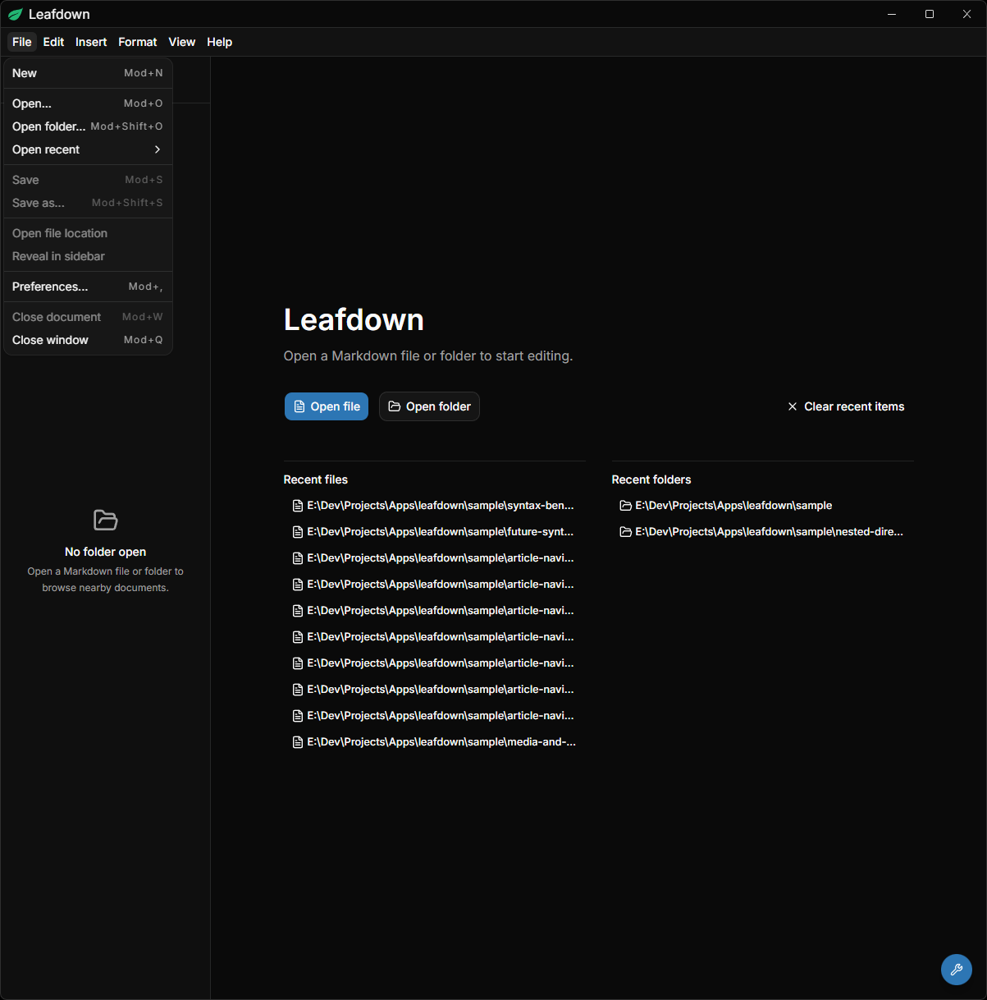
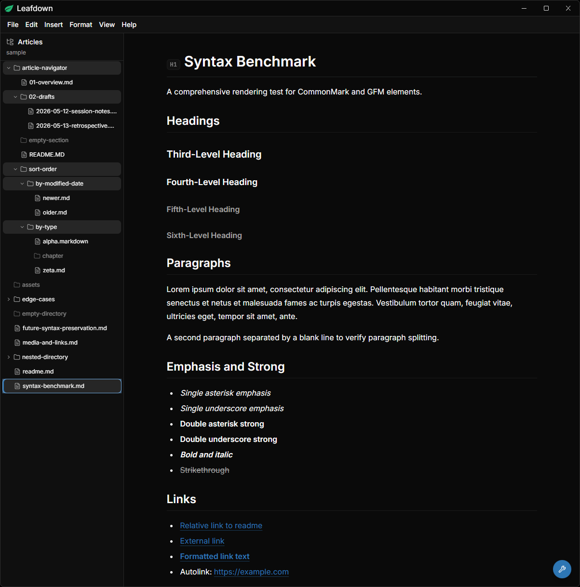

# Leafdown

Leafdown is an open-source, local-first Markdown desktop app for ordinary files and folders. It is built for quickly opening, reading, and editing Markdown without adopting a vault, workspace, cloud service, or IDE.

The initial internal alpha has been released. Leafdown remains under active development and is not yet packaged for broad redistribution.

## What It Does

- Opens individual Markdown files and ordinary folders.
- Shows supported Markdown files in a folder-aware article navigator.
- Provides one hybrid WYSIWYG Markdown editor instead of split source/preview panes.
- Saves clean Markdown back to disk while preserving Markdown semantics.
- Handles dirty documents, recent files and folders, local links, local images, and filesystem watcher refreshes.
- Runs offline without accounts, telemetry, cloud sync, or project metadata in opened folders.

## Screenshots

## Project

- [Documentation](./docs/README.md): product behavior, decisions, architecture,
  and engineering patterns.
- [Changelog](./CHANGELOG.md): release notes.
- [Contributing](./CONTRIBUTING.md): local development and contribution workflow.
- [Security](./SECURITY.md): private vulnerability reporting.

## License

This project is licensed under the [GNU General Public License v3.0 or later](./LICENSE).
