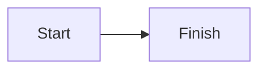
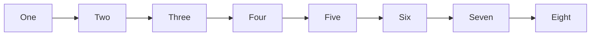
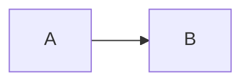

# Mermaid diagrams

Standard fenced diagram with source available through Edit source:



Wide diagram scrolls sideways at its drawn size:



Tilde fence, mixed-case language, and preserved extra info:

~~~Mermaid title="workflow"
sequenceDiagram
  Alice->>Bob: Hello
~~~

Configuration directive stays editable as source:



Malformed diagram stays editable as source:

```mermaid
flowchart LR
  A[unterminated
```

Unknown language remains an ordinary code block:

```mermaidish
flowchart LR
  A --> B
```
