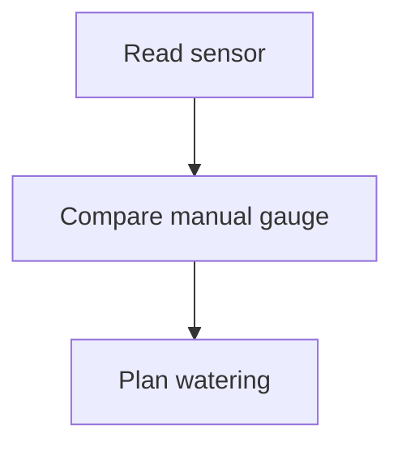

# Field Research Format Notes

> [!NOTE]
> The north-bed reading should be compared with the afternoon manual gauge.

The historical record is kept in [[Community Garden Sensor Pilot]]. Research
notes cite [@doe2026; @roe2024] while the bibliography is assembled.

Calibration
: Comparing a probe with a trusted manual measurement.

The quick estimate uses $E = mc^2$ as a placeholder:

$$
\int_0^1 x^2 dx = \frac{1}{3}
$$

:::note
The team will keep this directive-style reminder in the draft for now.
:::
