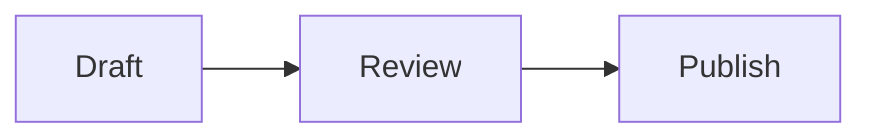

# Markdown reference

Leafdown opens `.md` and `.markdown` files and saves ordinary Markdown. Type these forms in a document or paste them as Markdown. Editing a rendered element may reveal its source markers.

## CommonMark and GitHub Flavored Markdown

Use headings, paragraphs, emphasis, strong text, links, images, blockquotes, lists, thematic breaks, inline code, and fenced or indented code blocks. Leafdown also supports GFM tables, task lists, strikethrough, autolinks, and footnotes.

```text
# A heading

**Strong**, _emphasis_, ~~struck text~~, and `inline code`.

> A quotation with a [link](https://example.com).

- One item
- [x] A completed task
- [ ] An open task

1. First
2. Second

| Name | Value |
| ---- | ----- |
| One  | Two   |


A footnote[^note] and its definition.

[^note]: More detail.

---
```

Use three backticks or tildes around a fenced code block. An optional language name enables highlighting when Leafdown knows it. The language badge on a block can change that name without editing its fence by hand.

## Leafdown-supported extensions

These forms work in Leafdown alongside the CommonMark and GFM content above. They are not all part of standard GFM.

**Wiki links** target Markdown files relative to the current saved document. A label changes the displayed text, and a heading fragment jumps to the first exact matching heading. Missing targets stay unresolved instead of creating files.

```text
[[notes/meeting]]
[[notes/meeting#Decisions|Meeting decisions]]
```

**Definition lists** use Pandoc-style `:` or `~` markers with a space before the definition text.

```text
Term
: Its definition.

Another term
~ Another definition.
```

**Math** uses dollar delimiters, or a fenced code block whose language is exactly `math`. A `$$` span alone in its paragraph is displayed as a centered block. TeX is rendered locally; it never loads an external resource.

````text
Inline math: $a^2+b^2=c^2$.

$$
E = mc^2
$$

```math
\int_0^1 x^2\,dx = \frac{1}{3}
```
````

**Mermaid diagrams** use a fenced code block whose first info word is `mermaid`. The diagram shows while the caret is elsewhere; click it or arrow into it to edit its syntax-highlighted code, and the diagram updates below once you pause. Wide diagrams scroll sideways at their natural size. Diagrams use Leafdown's light or dark colors, render locally, and never load an external resource. Configuration directives and frontmatter are kept but not previewed.

````text

````

**Callouts** support GitHub alert blocks, Material for MkDocs admonitions, and Docusaurus or VitePress colon fences. Supported types and titles depend on the dialect. For example:

```text
> [!NOTE]
> Keep a copy of the source file.

!!! warning "Before you save"
    Check changes made by another program.

::: tip
Keep related articles in one folder.
:::
```

**Frontmatter** is a metadata block at the very start of a document: YAML between `---` lines, TOML between `+++` lines, or JSON between `;;;` lines. Edit it as source. Invalid syntax shows an error but never blocks saving, and the block is saved as you left it. **Insert > Frontmatter** adds an empty block. Leafdown gives its keys no special meaning.

```text
---
title: Garden report
tags: [notes, garden]
---
```

Leafdown also displays self-contained raw HTML from a restricted set of elements when there are no attributes. Unsupported HTML remains source text. The [Specification](https://github.com/Azganoth/leafdown/blob/main/docs/specification.md) describes the exact supported elements and extension rules.

For where links and images resolve, see [File and folder workflows](file-and-folder-workflows.md).
